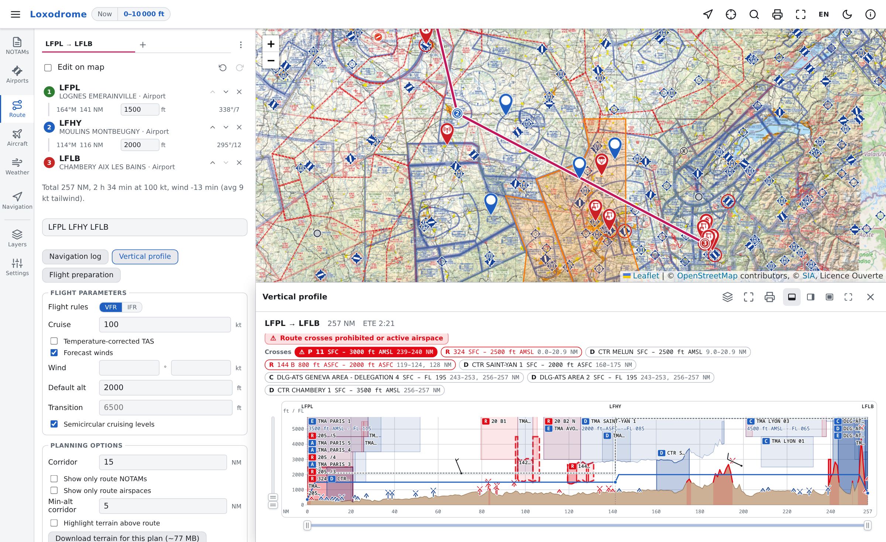

# Loxodrome

[](https://github.com/0intro/loxodrome/actions/workflows/ci.yml)
[](https://github.com/0intro/loxodrome/actions/workflows/deploy.yml)
[](LICENSE)

A flight-preparation and in-flight navigation application for general
aviation, built on the national AIPs of Europe and the United States. It draws
them as an aeronautical chart, plans the flight down to the fuel, the mass and
balance and the takeoff and landing distances, briefs it, and follows it in
the cockpit. It runs entirely in the browser, installs on the device for
offline use, and needs no account.

A loxodrome is the course that crosses every meridian at a constant angle.

Deployed as a static site at <https://loxodrome.fr/>.



This is a situational-awareness aid, not an official source. The
pilot-in-command stays responsible for the preflight briefing: check the
NOTAMs, the weather and the aircraft figures against the authoritative
sources for your jurisdiction before you fly.

## What it does

**Chart and AIP.** The airspaces, aerodromes, navaids, obstacles, protected
sites and AIP supplements each publisher files, drawn to the ICAO and SIA
chart conventions and dated by the cycle each publisher states, over a
worldwide aerodrome baseline. The official VFR chart layers stack on top, and
an aerodrome opens what its AIP publishes: runways, frequencies, the
directory entry and the charts.

**Flight preparation.** Routes and their alternates, cruising levels set
against the terrain and the transition altitude, forecast winds leg by leg,
the navigation log and the vertical profile; then the fuel plan, the mass and
balance and the takeoff and landing distances, computed from the aircraft's
own flight-manual figures and printed as a flight dossier or as A5 kneeboard
cards.

**Briefing.** NOTAMs, pasted or fetched for the map view or the route
corridor, linked both ways with the aerodromes, airspaces, navaids and
obstacles they concern and hatching the zones they activate; METAR, TAF and
SIGMET; winds and temperatures aloft; the TEMSI and WINTEM charts.

**In flight.** The map follows the GPS, the navigation log stamps the times
actually flown, the contact chain gives the frequency in force, and airspace
alerts warn by the action each zone requires; afterwards the replay, the
trace as GPX, IGC or KML, and the flights library.

Eight tabs hold it, in flight order:

| Tab | What is in it |
|------------|--------------------------------------------------------|
| NOTAMs | Load a briefing, pasted, from a file or fetched for the map view or the route, then read, filter and print it |
| Airports | Search an aerodrome by indicator, name or town, and open its AIP entry, its charts and its weather |
| Route | Build the routes, set their cruising levels, and open the navigation log, the vertical profile and the flight preparation |
| Aircraft | Pick the aircraft the preparation computes with; edit its data sheet or add one of your own |
| Weather | METAR, TAF and SIGMET, the winds aloft, and the TEMSI and WINTEM charts |
| Navigation | Record the flight, replay it, set the airspace alerts, and import or export the trace |
| Layers | The base map, the aeronautical chart layers, every overlay and the publishers behind them |
| Settings | NOTAM markers, content languages, live data, position, appearance, and the reset |

Beside the tabs, the toolbar carries the **viewing conditions**: the period
the map is read at (now plus a look-ahead, the planned flight's own span, or
a typed range) and a level band. The period governs every dated surface at
once: NOTAMs, SUP AIP zones, SIGMETs and the airspace activation hatch, but
never an airspace itself, which carries no date. The level band applies to
all four, airspaces included. Ctrl+K searches aerodromes, navaids, waypoints,
NOTAMs and the application's own actions from anywhere; the `?` key lists
every shortcut and gesture.

## The map

Airspaces, aerodromes, navaids and obstacles follow the chart conventions of
the French SIA 1:500 000 and ICAO Annex 4, uniformly across publishers rather
than in each publisher's own style. Interiors stay chart-faithful, which
means no resting fill: a zone is read from its boundary, its class-coloured
inside band, its hatch and its activity pictogram.

The **Layers** tab groups the airspaces into seven categories, each with its
own toggle:

| Category | Holds |
|-------------------------------------|----------------------------|
| Controlled (TMA / CTR / CTA / LTA / ATZ) | and TRSA, UTA, delegated ATS, free-route airspace, and the volumes filed by class alone, A to E |
| Restricted / Danger / Prohibited | R, D, P, MOA, W, A, ADIZ, CBA, TFR |
| Aerial activities | paragliding, parachute, balloon, glider, towing |
| Traffic management (TMZ / RMZ) | and the zones demanding both |
| Temporary reserved (TRA) | and TSA |
| Flight info sectors (SIV) | the approach-run sectors and the FIR-level ones |
| FIR / UIR / control centres | including the US ARTCCs, which are FIR-equivalents |

Aerodromes draw as aviation-chart symbols, coloured by status: civil (blue),
military (red) and restricted (grey), with paved, unpaved, joint, seaplane,
heliport and closed variants. Navaids draw their ICAO symbols (VOR, DME, NDB,
TACAN, ILS, RNAV waypoints, VFR reporting points). Aerodromes, navaids and
obstacles carry their own group toggles and per-feature zoom thresholds, so a
low zoom stays readable: navaids appear from zoom 6, ILS from 8, waypoints
from 9, obstacles from 9.

Thirteen official VFR chart layers stack over the map, each its own checkbox,
the check order deciding the draw order where they overlap: the French SIA
1:500 000 and 1:250 000, ENAIRE Spain, Naviair Denmark and the Faroes, EANS
Estonia, Isavia Iceland, HungaroControl, swisstopo, and the FAA sectional,
TAC, helicopter and Caribbean charts. Each says what it covers. Underneath
sit five base maps (OpenStreetMap, OpenTopoMap, IGN Ortho, Google Satellite,
Bing Aerial).

Click any feature for its details. Right-click anywhere for everything under
the cursor, whatever the layer toggles say: NOTAMs, METAR stations,
aerodromes, navaids, airspaces, obstacles, SUP AIP zones and SIGMETs, each
row highlighting its feature on hover and opening it on click. The same menu
copies the coordinates, adds or inserts a route waypoint, and opens the
altitude profile of the stack at that point.

The map view lives in the URL, on OpenStreetMap's slippy-map convention:
`#map=<zoom>/<lat>/<lon>[&layer=<id>][&charts=<id,id,...>]`. Any view is a
shareable link, chart stack included.

## Briefing

### Loading NOTAMs

Four ways, all landing on the same parser, so everything downstream behaves
the same:

- **Paste** a briefing into the **NOTAMs** tab, or use the paste button.
- **Load a file**, or open one into the application from elsewhere.
- **Fetch for the current map view.**
- **Fetch along the planned route**, within a corridor radius you choose.

The two fetches offer a choice of service, with no account to set up either
way:

| | SOFIA-Briefing (default) | autorouter |
|---------------|------------------------------|--------------------|
| Operator | French DSNA / SIA | autorouter.aero |
| Upstream | the French national AIS PIB | EUROCONTROL EAD |
| Credentials | anonymous | one application credential, held in the proxy |
| Selection | the route corridor as a geometry | aerodromes and FIRs along the track |
| Look-ahead | about 24 hours | 30 days |
| Server-side filtering | flight rules and level band | none |

Both brief the whole planned route, foreign airspace included. Requests go
through a small [proxy Worker](notam-proxy/), because neither upstream sends
CORS headers and SOFIA needs headers a browser will not let a page set.

### What the parser reads

The standard ICAO fields (Q, A, B, C, D, E, F, G). Content ends at the first
blank line that is not followed by another section marker, since real
briefings wrap E) coordinate blocks and F)/G) items in blank lines. Output
from [SOFIA-Briefing](https://sofia-briefing.aviation-civile.gouv.fr/) and
[autorouter](https://www.autorouter.aero/notam) parses cleanly, in English or
French: the extractors are language-invariant, and a test pairs the France
NOTAMs of a bilingual world briefing by identifier to keep them that way.

A NOTAM is plotted from whichever geometry it carries, each in its own
colour:

- **Position** (red marker): DMS coordinates after `PSN`, `CENTRE`, `OBST`
  and the like. A nearby radius (`RADIUS`, `RAYON`, in NM, KM or metres) adds
  an orange circle.
- **Area** (orange polygon): three or more coordinates after `LATERAL
  LIMITS`, `LIMITES LATERALES`, `AREA`, `WI COORD`, `FLW COORDS` and their
  equivalents in other national styles, or a chain that simply closes on
  itself. A multi-area NOTAM becomes one entry per ring.
- **Qualifier line** (blue marker): the Q-line centre, used when nothing else
  matched. Its radius of influence draws on selection rather than always.

The DMS reader is forgiving: seconds optional, the hemisphere letter optional
after the digits, packed or spaced, implicit decimals. Features are drawn
largest first, so a click resolves to the tightest feature under the cursor.

### What a NOTAM is linked to

Ownership is the ICAO rule, not geometry: a NOTAM is filed under one
aerodrome or up to seven FIRs, and its Q-line scope says which. On top of
that, thirteen relationship mechanisms connect a NOTAM to what it concerns,
and each works in both directions: activation by designator, the airspace
named in the text, designator citations, aerodrome and runway references,
frequency changes, AIP supplements, navaids, obstacles, the trigger NOTAM and
the supplement it triggers, and the route corridor. A panel therefore always
lists its counterpart, even when that layer is switched off. Geometric
containment is the one tier that is opt-in, in the Settings tab.

A NOTAM whose Q-code activates a known airspace hatches it for as long as its
validity reaches into the period being viewed. The French RTBA low-level
network and the SIA AIP SUP zones activate the same way, each on its own
published schedule, so one zone of a network can go quiet while its siblings
run on.

Six filter dimensions narrow the briefing: the fetched viewport, the route
corridor, the kind of geometry, the level band, the flight rules and free
text. A NOTAM outside the period is not dropped, only demoted to its own
section of the list, where it stays readable and selectable. The whole
briefing prints as an A5 two-up bulletin.

## Route planning

The **Route** tab builds a route by typing identifiers and free coordinates
(`LFPL N48,8200/E2,62000 LFQB`) or by clicking the map; drag a waypoint to
move it, or drop one onto a leg to insert it. Several routes coexist, each in
its own colour, an alternate sharing its trip's hue.

Each leg gets a cruise altitude. Automatic legs are capped below any Class A
they cross, then snapped to the semicircular cruising-level table on the
leg's magnetic track. A leg you set by hand is never rewritten; it is flagged
instead when it disagrees with the table. Levels above the transition
altitude display and edit as flight levels, the transition altitude itself
coming from the AIP data of the aerodromes and airspaces along the route,
with a manual override. From there:

- **Navigation log**: cruise altitude and minimum safe altitude, magnetic
  course and heading, leg and remaining distance, still-air and
  wind-corrected time, estimated and actual times over, and the frequencies
  of the aerodromes and airspaces each leg crosses. It prints as an A4
  kneeboard, or as A5 cards split by measurement rather than by estimate.
- **Vertical profile**: distance against altitude, showing the terrain, every
  airspace band the route crosses, the planned altitude with the aircraft's
  own climb and descent gradients, the minimum safe altitude step line,
  corridor obstacles, forecast wind barbs, the freezing level, cloud layers
  and the NOTAM bands with their activation hatch. Pan and zoom by drag,
  wheel, pinch or the range sliders, and print it in landscape.
- **Corridor NOTAMs**: fetch the NOTAMs within a chosen radius of the route,
  and optionally narrow the whole briefing to that corridor.

Forecast winds resolve per leg from the winds-aloft model, under a per-leg
manual override; a level advisor scans the compliant levels for the fastest
one.

Routes save and load as YAML, anchored to identifiers where they exist and to
plain coordinates otherwise, with the planning settings and the flight
preparation alongside them. Terrain elevation comes from AWS Terrarium tiles,
sampled through the same proxy Worker. A finished route can be handed to
SendFPL, a separate Android application, which uploads it to a Garmin
navigator after the pilot reviews it there.

## Flight preparation

The workbook is four pages over one aircraft and one plan:

- **Overview**: the dossier front sheet. A timeline over the aerodrome chain
  with estimated departure and arrival, ground times and the endurance limit;
  sunrise and sunset at each end point; the aircraft and pilot administrative
  checks.
- **Fuel plan**: taxi, trip, procedure and wind allowance, then the reserve
  as alternate, procedure, discretionary margin and final reserve. The final
  reserve is 45 minutes for night or IFR and 30 minutes only for VFR by day,
  night being derived from the timeline rather than a switch. When one tank
  will not do, it enumerates the stopover subsets and recommends the fewest
  refuels.
- **Mass and balance**: stations, fuel by tanked grade and density, takeoff,
  landing and zero-fuel points against the CG envelope, with the burn
  hyperbola drawn between them.
- **Performance**: takeoff and landing distances interpolated from the
  aircraft's own flight-manual figures, with surface, slope, wind and margin
  factors, judged against the declared distances published for each runway
  end.

Fifteen aircraft data sheets ship with the application (Robin DR400 variants,
Piper PA28 and PA28R, a Cirrus SR22), and the editor adds your own: general
data, stations and envelope, the performance grid or its fitted coefficients,
or the raw YAML. Sheets import and export as YAML files.

Two pack buttons print the workbook: the four pages, or the full flight
dossier, which adds each trip's navigation log, radio and airspace schedule
and vertical profile, then the weather annex.

## Weather

Live weather is one switch in Settings, on by default, and every surface it
feeds refreshes on a shared minute tick:

- **METAR and TAF** from the NOAA Aviation Weather Center, per aerodrome in
  the panels and as flight-category dots with observed wind barbs on the map.
  A station opens its own panel whether or not it is a known aerodrome.
- **SIGMETs**, international and US, drawn as hazard polygons with the raw
  bulletin as the authority.
- **Winds and temperatures aloft** from Open-Meteo, as station-model barbs on
  the map, per-leg planning wind in the navigation log, and an isotherm and
  mean-sea-level isobars over the lattice.
- **TEMSI and WINTEM charts**, listed per zone from the Météo-France catalog
  through the SOFIA relay. The links are tokenised and expiring, so they are
  listed fresh and never stored or rehosted.

The weather briefing prints on its own: the METAR and TAF cards, then the
charts relevant to the planned flight.

## In flight

The navigation mode is the flight mode; there is no separate configuration.
One toolbar button starts the flight, and while it runs the screen stays
awake, the controls grow to a 44 px touch target, and the theme follows civil
night at the aircraft's own position.

- **Recording** the GPS trace, with a live instrument strip over the map (GS,
  magnetic track, GPS altitude, time to the active waypoint).
- **The live navigation log** stamps each waypoint's first crossing as its
  actual time over, freezes the rows behind it the way a hand-kept log does,
  and re-estimates only the leg being flown. The radio and airspace schedule
  stamps its own crossings beside the plan.
- **The contact chain** resolves the frequency in force from the departure
  aerodrome, through the controlled, radio-mandatory and information sectors
  the route crosses, to the destination, and optionally the nearest open
  aerodrome overflown.
- **Airspace alerts** grade a zone by the action it requires of the pilot,
  not by its type: avoid, clearance, radio, transponder or caution, read from
  the entry conditions the AIP publishes for each traffic category. They
  evaluate the position and a dead-reckoned lookahead against the airspaces,
  the SUP AIP zones and the NOTAMs with geometry. They are advisory, and
  worded that way: they state the fact and the published requirement, never a
  manoeuvre.
- **A plan of several routes is flown one route at a time**, the handover
  triggered by arrival rather than landing, so a touch-and-go keeps its
  place.
- **Afterwards**: replay with a playhead, a vertical profile of the recorded
  trace, and export as GPX, IGC or KML. Traces import in those three formats
  and in the KMZ container Google Earth writes. The IGC file declares itself
  a non-approved recorder, so it serves a debriefing and not a badge claim.

Recorded flights collect in the **flights library**, a carnet-shaped table of
dates, aerodromes, block times, landings and night time, derived from the
traces and re-derivable whenever the detectors improve. It is an aid to the
logbook, never one: the columns a pilot must declare are absent, and there is
no currency arithmetic. Its CSV export is shaped to transcribe row by row
into an EASA Part-FCL logbook, leaving those declared columns empty on
purpose. Plans are remembered beside the flights, and a stored plan can be
activated into the workspace.

## Install and offline

The application is an installable PWA. Installed, it starts and runs with no
network: the shell, the datasets, the terrain and the map tiles you have
already seen are cached. Live safety data never is. There are no offline
NOTAMs, no offline METAR, TAF or SIGMET and no offline winds, by design; a
stale briefing is worse than an absent one.

Terrain for a plan can be pinned deliberately: one action downloads every
tile within the corridor of every route, so the minimum safe altitudes,
heights above ground and alert terrain still answer with no network.

A new version and a newly effective AIRAC cycle each raise their own banner
rather than reloading under you.

## The Android app

The same application ships as an Android app, a Capacitor shell around the
same build. It adds what a browser cannot promise:

- **Offline chart packs.** A whole chart layer downloads as one archive and
  is then served locally, resumable and cancellable, listed under each chart
  in the Layers tab. Browsers hold that storage as reclaimable quota, so the
  download is offered only in the app; a pack already on disk serves its
  chart everywhere.
- **A recording that survives.** A foreground service owns the GPS and
  journals every fix, so backgrounding, screen-off and even swiping the app
  away do not lose the flight.
- **Print, share and open-with.** Printing goes through Android's own print
  framework, exports go to the share sheet, and the app appears in "Open
  with" for the files it understands.

It is built from this repository (`npm run android:apk`) and is not
distributed through any store.

## Privacy

There is no account, no sign-in and no analytics. Routes, aircraft, settings
and recorded flights live in the browser's own storage on your device, and
the reset in the Settings tab erases them.

Map tiles and the raster charts come from their own tile servers, as with any
web map. Past those, four kinds of request go through the same small
[proxy Worker](notam-proxy/), which exists because the upstreams send no CORS
headers: the NOTAM fetches, METAR, TAF and SIGMET, the terrain tiles, and the
weather-chart PDFs for the printed dossier. Winds aloft go directly to
Open-Meteo. The worker holds the one autorouter credential server-side and
handles SOFIA's session cookie itself, so no cookie is ever set on or read
from the browser. It applies a rate limit and a short response cache, and it
logs its own failures without ever recording request bodies, cookies, tokens
or client addresses.

## Languages

The interface is in English and French, complete in both: the French catalog
is a structural mirror of the English one and the build fails on a missing
key. The language follows the browser until you choose one. Downloaded
bilingual content, the AIP SUP subjects, the SOFIA NOTAM texts and the SIA
free-text remarks, follows the interface language by default and can be
pinned to either.

## Data sources

| Source | Contents |
|--------|----------|
| [SIA AIXM 4.5 (France)](https://www.sia.aviation-civile.gouv.fr/) | airspaces, obstacles, aerodromes and their directory entries, navaids, protected sites |
| [NATS AIXM 5.1 (UK)](https://nats-uk.ead-it.com/cms-nats/opencms/en/Publications/digital-datasets/index.html) | airspaces, obstacles, aerodromes and their directory entries, navaids |
| [ENAIRE AIXM 5.1 (Spain)](https://aip.enaire.es/AIP/DatosDigitales-en.html) | airspaces, obstacles at or above 30 m AGL, aerodromes and their contacts, navaids |
| [skeyes eAIP (Belgium & Luxembourg)](https://ops.skeyes.be/html/belgocontrol_static/eaip/eAIP_Main/html/index-en-GB.html) | airspaces, significant en-route obstacles, aerodromes and heliports with their directory entries and chart links, navaids, bird areas, AIP supplements |
| [DFS AIXM 5.1.1 (Germany)](https://aip.dfs.de/datasets/) | airspaces, obstacles, aerodromes and their directory entries, navaids, chart links |
| [Austro Control (Austria)](https://www.austrocontrol.at/en/pilots/pre-flight_preparation/aim_products) | airspaces, obstacles, aerodromes, navaids, chart links |
| [LVNL open data (Netherlands)](https://geoportaal.lvnl.nl/) | airspaces, aerodromes, navaids |
| [Sakaeronavigatsia AIXM 5.1.1 (Georgia)](https://ais.airnav.ge/en/aip-dataset) | airspaces, aerodromes and their directory entries, navaids |
| [FOCA obstacle register (Switzerland)](https://www.bazl.admin.ch/de/digitale-luftfahrthinderniskarte) | obstacles |
| [Fintraffic ANS obstacle register (Finland)](https://www.ais.fi/ais/aipobst/aipobst.htm) | obstacles at or above 100 m AGL (the AIP's Area 1 set) |
| [open flightmaps OFMX (Italy)](https://openflightmaps.org/) | airspaces, aerodromes, navaids, protected sites (community-maintained, not the Italian AIP) |
| eAIP packages (Slovakia, Ireland, Serbia & Montenegro, Kosovo) | airspaces, and en-route navaids for all but Kosovo |
| [SIA AIP SUP (France)](https://www.sia.aviation-civile.gouv.fr/) | temporary supplement zones and their activation schedules, parsed from the PDFs |
| [EUROCONTROL pruatlas](https://github.com/euctrl-pru/pruatlas) | FIR / UIR boundaries worldwide |
| [FAA AIS (United States)](https://services6.arcgis.com/ssFJjBXIUyZDrSYZ/arcgis/rest/services) | ARTCC, R/P/D/MOA/W/A, Class A to E, aerodromes, navaids, obstacles at or above 500 ft AGL, chart links |
| [FAA Order JO 7360.1](https://www.faa.gov/regulations_policies/orders_notices/index.cfm/go/document.current/documentNumber/7360.1) | aircraft type designators |
| [OurAirports](https://ourairports.com/) | worldwide aerodrome baseline |
| [NOAA AWC](https://aviationweather.gov/) | METAR and TAF stations, SIGMETs (live) |
| [Open-Meteo](https://open-meteo.com/) | winds and temperatures aloft (live) |
| [AWS Terrain Tiles](https://registry.opendata.aws/terrain-tiles/) | ground elevation (live, cached) |

The raster VFR charts come from the SIA, ENAIRE and the FAA, plus Naviair,
EANS, Isavia, HungaroControl and swisstopo, and are served as tiles. The FAA
charts are public domain and the French ones are under Licence Ouverte; the
rest carry their publishers' own terms.

Every source's terms are read at the publisher's own document before its data
is committed, and the in-app **About** dialog prints what was read, along
with the effective dates and feature counts of everything bundled. That
reading is also why some pipelines exist without shipping: Czechia, Poland,
Hungary, Portugal, Slovenia, Bosnia-Herzegovina and Albania are implemented
and tested, and their data is withheld pending each publisher's consent.

Most publishers release the next AIRAC cycle about a month early. When they
do, the application ships it alongside the current one and switches over at
the effective time, offering a reload if that happens mid-session.

## Development

Node 24 and, for the dataset tools, Go 1.26. The datasets in `public/data/`
are committed, so the application runs without the Go tools.

```sh
npm install
npm run dev        # http://localhost:5173
npm run verify     # the full gate: lint, i18n lint, check, test, build
npm run build      # svelte-check, then build to dist/
npm run check      # svelte-check (types + Svelte)
npm test           # the Vitest suite
npm run lint       # ESLint + Stylelint
npm run lint:i18n  # the localisation rules
npm run android:apk    # the Android debug build
npm run android:bundle # the full gate, then the release bundle
```

The Go tools under `cmd/` regenerate the datasets. Each writes its rows plus
a `.meta.json` sidecar carrying the publisher's effective date, the row
counts and the bounding box the application gates its on-demand loading on:

| Tool | Reads | Writes |
|------|-------|--------|
| `airports` | OurAirports | `airports.json` |
| `fr` | SIA AIXM 4.5 | `fr-{airspaces,obstacles,airports,navaids,nature,aerodrome-facilities}.json` |
| `uk` | NATS AIXM 5.1 | `uk-{airspaces,obstacles,airports,navaids,aerodrome-facilities}.json` |
| `es` | ENAIRE AIXM 5.1 | `es-{airspaces,obstacles,airports,navaids,aerodrome-facilities}.json` |
| `be` | skeyes eAIP HTML | `be-{airspaces,obstacles,airports,navaids,nature,supaip,aerodrome-facilities}.json` |
| `de` | DFS AIXM 5.1.1 | `de-{airspaces,obstacles,airports,navaids,adcharts,aerodrome-facilities}.json` |
| `at` | Austro Control KML + AIXM 5.1.1 | `at-{airspaces,obstacles,airports,navaids,adcharts}.json` |
| `nl` | LVNL ArcGIS | `nl-{airspaces,airports,navaids}.json` |
| `ge` | Sakaeronavigatsia AIXM 5.1.1 | `ge-{airspaces,airports,navaids,aerodrome-facilities}.json` |
| `ch` | FOCA obstacle register (AIXM) | `ch-obstacles.json` |
| `fi` | Fintraffic ANS Area 1 (CSV) | `fi-obstacles.json` |
| `it` | open flightmaps OFMX | `it-{airspaces,airports,navaids,nature}.json` |
| `eaip` | generated eAIP packages | `{sk,ie,rs,xk}-airspaces.json`, `{sk,ie,rs}-navaids.json` |
| `supaip` | SIA AIP SUP listing + PDFs | `fr-supaip.json` |
| `adcharts`, `ukcharts` | SIA and NATS eAIP | `fr-adcharts.json`, `uk-adcharts.json` |
| `pruatlas` | EUROCONTROL pruatlas | `pruatlas-firs.json` |
| `faa` | FAA AIS | `faa-{airspaces,airports,navaids,obstacles}.json`, `us-adcharts.json` |
| `metar` | NOAA AWC station crawl | `metar-stations.json` |
| `designators` | FAA Order JO 7360.1 (PDF) | `faa-designators.json` |

Two more are one-off maintenance tools: `bbox` splices a bounding box into a
sidecar that predates the field, and `geoid` generates the bundled EGM96
lattice.

What the commands share lives in `internal/`: `aip` (source reading, AIRAC
slot resolution, JSON writing), `aixm5` (the AIXM 5.1 decoder behind eleven
of them), `aixm5build` (the row builders every AIXM publisher shares), `eaip`
(the eAIP HTML reading `be` and `eaip` share), `geodesy`, `firarcs` and
`overlay`. Test them with `go test ./cmd/... ./internal/...`.

Every public dataset refreshes on a schedule through GitHub Actions, and a
refresh redeploys the site. The French AIXM sets need the proprietary SIA
export and are rebuilt by hand, as is the FAA designator list, which follows
its own yearly edition. `notam-proxy/` is a self-contained sub-project with
its own README and test suite, deployed by hand.

## Limitations

- Coordinate extraction is heuristic: the E) section is not standardised.
  Most French and EASA-country NOTAMs parse cleanly; outliers sometimes do
  not.
- Airspace coverage is the AIPs of France, the UK, Spain, Germany, Austria,
  Belgium and Luxembourg, the Netherlands, Georgia, Slovakia, Ireland, Serbia
  and Montenegro and Kosovo, the US Class and special-use airspace, Italy
  through the community open flightmaps data, and the FIR and UIR boundaries
  worldwide. Elsewhere only the FIR ring is drawn. Seven more States are
  implemented and withheld pending consent, and Canada publishes no free
  airspace product at all.
- Obstacle data covers France, the UK, Spain, Germany, Austria, Switzerland,
  Finland, Belgium and Luxembourg, and the US, each at the threshold its
  publisher files.
- AIP supplement deep links cover the French SIA and the Belgian eSUP. Other
  AIPs are detected but not linked.
- Country datasets load on demand by area: a country's rows arrive when the
  map, a route or a loaded NOTAM reaches it.
- A NOTAM that defines several polygons at different flight levels draws each
  polygon, but the level filter treats them as one band.
- Offline chart packs and a recording that survives being backgrounded are
  Android-only. There is no iOS application.
- The interface exists in English and French only.
- This is one person's project, published in the hope it is useful, with no
  warranty and no support commitment.

## License

MIT, &copy; 2026 David du Colombier. See [LICENSE](LICENSE).
